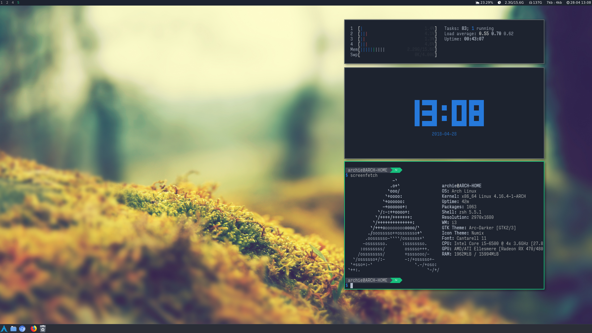

# dotfiles

My Mac and Linux setup. `flake.nix` has two parts:

- **Mac:** nix-darwin (`darwin.nix`) installs the apps through Homebrew and
  runs Home Manager.
- **Linux (Arch, Ubuntu, Debian):** standalone Home Manager.

Both use `home.nix`, which installs my command-line tools from nixpkgs and
links the terminal dotfiles (zsh, bash, git, tmux, vim, nvim, lazygit, nix)
from `~` into this repo. The links point at the checkout, not a copy, so
edits apply without a rebuild.

The other top-level folders are GNU stow packages for Mac apps (karabiner,
yabai, zed, vscode, cursor, claude, agents). The i3, sway, rofi, termite and
other X11 packages are from an old Arch Linux machine and are not used.

## New Mac

[SETUP.md](SETUP.md) is a runbook for an agent: it walks me through the whole
setup one step at a time. To start it:

```sh
/bin/bash -c "$(curl -fsSL https://raw.githubusercontent.com/Homebrew/install/HEAD/install.sh)"
eval "$(/opt/homebrew/bin/brew shellenv)"
sh <(curl --proto '=https' --tlsv1.2 -L https://nixos.org/nix/install)
curl -fsSL https://claude.ai/install.sh | bash
git clone https://github.com/sjsivert/dotfiles.git ~/dotfiles
```

Open a new terminal so `nix` is on PATH, then:

```sh
cd ~/dotfiles && ~/.local/bin/claude
```

Then ask it to set up the machine from SETUP.md. There's no need to add
`brew shellenv` to `~/.zprofile`: after the first switch, nix-darwin puts
Homebrew on PATH after the Nix tools.

## New Linux machine

The config expects the user `sjsivert` and the repo in `~/dotfiles`.

```sh
sudo apt install zsh git curl xz-utils build-essential   # Arch: sudo pacman -S zsh git curl base-devel
sh <(curl --proto '=https' --tlsv1.2 -L https://nixos.org/nix/install) --daemon
git clone https://github.com/sjsivert/dotfiles.git ~/dotfiles
```

Open a new terminal so `nix` is on PATH, then:

```sh
nix --extra-experimental-features 'nix-command flakes' run home-manager/master -- \
  switch -b pre-dotfiles --flake "$HOME/dotfiles"
chsh -s "$(command -v zsh)"
```

- On ARM, use `--flake "$HOME/dotfiles#sjsivert-aarch64"`.
- `-b pre-dotfiles` renames files already in the way, such as the distro's
  `~/.bashrc`, instead of failing.
- Log in again so zsh is the login shell. The first start clones the zsh
  plugins.
- `build-essential` (Arch: `base-devel`) gives nvim-treesitter a C compiler.
- The linked `.gitconfig` rewrites GitHub https URLs to ssh, so `git pull` in
  `~/dotfiles` needs an SSH key on the machine.

## Day to day

| To | Do |
|---|---|
| Apply a change on the Mac | `sudo darwin-rebuild switch --flake "$HOME/dotfiles#mac"` |
| Apply a change on Linux | `home-manager switch --flake "$HOME/dotfiles"` |
| Add a command-line tool | Add it to `home.packages` in `home.nix` ([search](https://search.nixos.org/packages)) |
| Add a Mac app | Add it to `homebrew.casks` in `darwin.nix` |
| Update everything | `nix flake update`, switch, commit `flake.lock` |

- Quote the flake reference. My zsh sets `extendedglob`, which reads `#` as
  a glob.
- Nix only sees files git knows about, so `git add` a new `.nix` file before
  switching.
- Edits to linked dotfiles apply right away, with no switch.

## Not in this repo

- **Raycast settings.** A password-protected export (`.rayconfig`, 2026-09-29)
  is in my Google Drive under `My Drive/Personlig/Mac-oppsett/`. It stays out of
  this repo because the repo is public. The password is the one I chose at
  export; it is not written down here.
- **Anything from an employer.** Work settings, skills, credentials and tokens
  never go in here.

## Old Arch Linux setup


